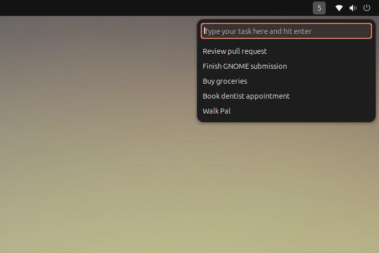
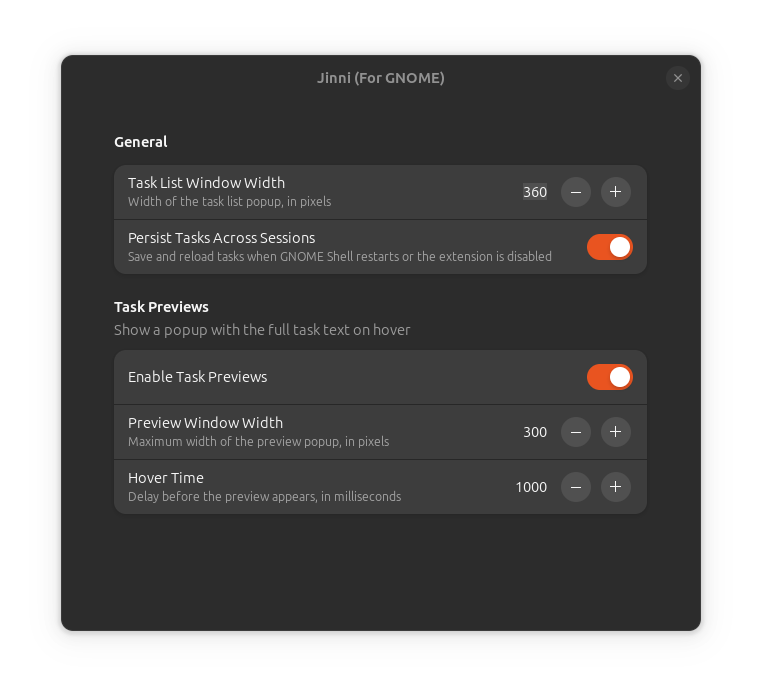

# Jinni (For GNOME)

A quick access task manager for the GNOME Shell top bar. Click the indicator, type a task, hit Enter — no windows to manage, no context switch.



## Features

- Add, edit, and delete tasks from a small dropdown in the top bar
- Drag and drop to reorder tasks
- Optional hover previews for long task text
- Optional persistence across GNOME Shell restarts
- Configurable window width, preview size, and hover delay in Preferences


Jinni's Preferences allow you to customize the dropdown and hover previews.



## Requirements

GNOME Shell 45 or later.

## Installation

Install from [extensions.gnome.org](https://extensions.gnome.org/) (search "Jinni"), or manually from a clone of this repo (run from the repo root, not from inside `jinni@udqu.github.io/`):

```bash
gnome-extensions pack jinni@udqu.github.io
gnome-extensions install jinni@udqu.github.io.shell-extension.zip
```

Then log out and back in, and enable it in the Extensions app (or `gnome-extensions enable jinni@udqu.github.io`).

## Credits

The original Jinni app was developed by Dino Angelov for OS X 10.8 or later (Intel only), released in 2015: https://mac.softpedia.com/get/Utilities/Jinni.shtml. This GNOME Shell extension is an independent implementation for Linux, since no equivalent existed there, and isn't affiliated with the original.

## License

GPL-2.0-or-later. See [LICENSE](LICENSE).
